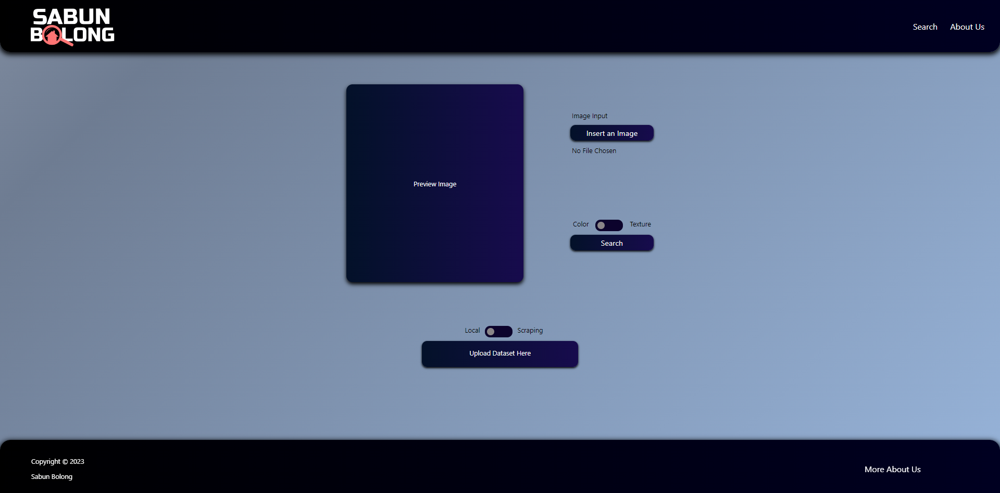

# Algeo02-22029

## Table of Contents
- [General Info](#general-information)
- [Features](#features)
- [Screenshots](#screenshots)
- [Usage](#usage)
- [Struktur Folder](#struktur-folder)
- [Programming Language Used](#languages)
- [Contacts](#contact)

## General Information <a name="general-information></a>
- Content-Based Image Retrieval (CBIR) with Color parameter and Texture Parameter
- CBIR application using Cosine Similarity of color vector and texture vector of each images.
- Color vector extraction using HSV of each 4x4 blocks and each of HSV range combinations.
- Texture vector extraction using GLCM (Gray-Level Occurence Matrix) Concept
- Contributors :
  1. 13522029 Ignatius Jhon Hezkiel Chan
  2. 13522098 Suthasoma Mahardhika Munthe
  3. 13522110 Marvin Scifo Yehezkiel Hutahaean 

## Features <a name="features"></a>
- CBIR Color Parameter
- CBIR Texture Parameter
- Image Website Scraping

## Screenshots <a name="screenshots><a/>


## Usage <a name="usage"></a>
1. Perform `npm install` in your terminal
2. Run `npm start`
3. Then the website will pop out in your browser with url "http://localhost:3030"
4. Click _search_ to move to Search menu
5. Select upload dataset method, either you want to upload from your local or scrape from a website.
   - Local
     1. Click "Upload Dataset Here"
     2. Drag a folder or select multiple images
     3. Click "Upload"
   - Scraping
     1. Enter the url of your choice, without "http://" or "https://" prefix.
     Example: "www.kompas.com"
     2. Click "Scrape"
6. After the alert pop out, proceed to click "Insert an Image" and choose the image you want. The preview of your image will be shown.
7. Pick the CBIR Method you want through the toggle
8. Click "Search", and then the results will be displayed in the pagination tab below according to the similarity percentage.

## Struktur Folder <a name="struktur-folder"></a>
```   
Algeo02-22029
├── doc                             # Laporan
├── img                             # Screenshot hasil uji coba program
├── src
│   ├── backend
│       ├── cbir                    # Source Color and Texture Processor
│       └── main.go                 # Backend main program
│   ├── dataset_vector              # Vektor color dan texture dari dataset
│   ├── image                       # Folder penyimpan query image
│   ├── public
│       └── dataset                 # Menyimpan imaga hasil scraping atau upload
│   ├── result                      # Menyimpan hasil temuan kemiripan image dengan query
│   ├── src                         # Berisi source code web
│   └── temp                        # Menyimpan data sementara dalam bentuk zip untuk import dataset lokal
└── test                            # Berisi gambar masukan untuk pengujian

```    

## Programming Languages Used
- FrontEnd : React Javascript
- BackEnd  : Golang

## Contacts <a name="contact"></a>
 Created by [@IgnatiusJHC](https://github.com/chankiel), [@SuthasomaMM](https://github.com/sotul04), dan [@MarvinScifoYH](https://github.com/scifo04)